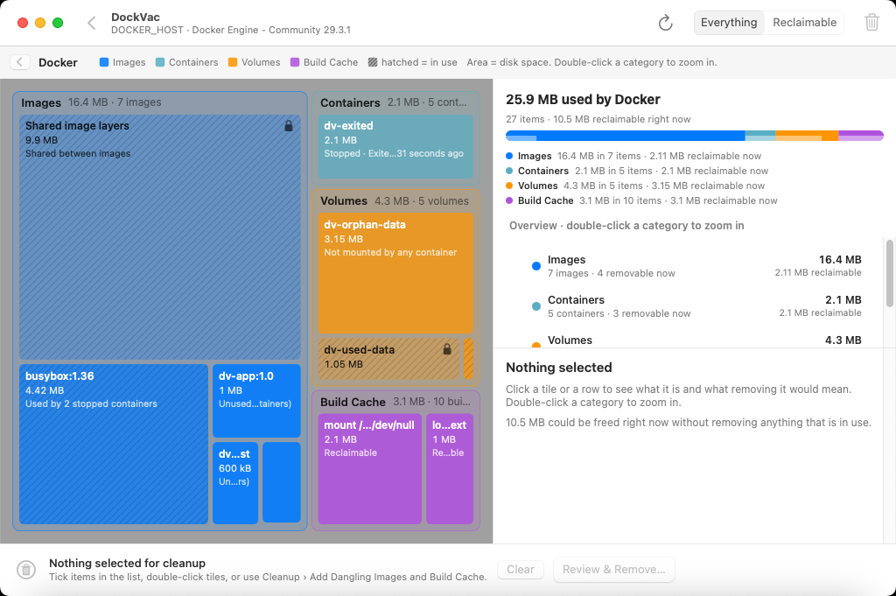
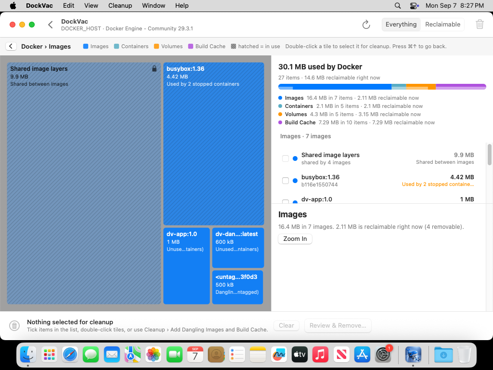
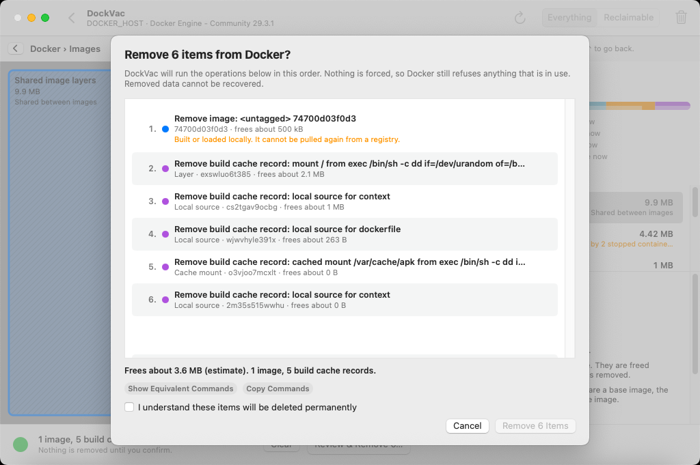

# DockVac

DockVac is a native macOS app that shows what Docker keeps on your disk as a treemap, and
lets you remove exactly the pieces you choose. No `docker system prune`, no surprises.

Every tile's area is proportional to the space it occupies. Images, containers, volumes,
and build cache each get a colour. Hatched tiles are in use and cannot be removed. Items
that hold data you might still want, such as volumes and stopped containers, are marked
with a caution tone and explained before you confirm anything.



Zoom into a category to see its items, and select one to find out exactly what it is, what
uses it, and what removing it would free:



Nothing is removed until you review the exact list of operations, in the order they run,
and confirm:



## What it does

- **Scans** the local Docker daemon over its unix socket using the Engine API, so sizes are
  exact bytes rather than the rounded figures the CLI prints.
- **Explains** every item: whether it is dangling, unused, or in use, which containers use
  it, whether an image can be pulled again, and roughly how much removing it frees.
- **Accounts the way Docker does**: layers shared between images get their own tile, so the
  images category adds up to what Docker itself reports, and build cache that is really an
  image's layers is counted under that image rather than twice.
- **Collects** the items you tick into a cleanup list. Adding an image that a stopped
  container still uses also adds that container, and tells you so.
- **Confirms** with a sheet that lists each operation in the order it runs, its estimated
  effect, warnings such as "volume contents are deleted permanently", and the equivalent
  `docker` commands.
- **Removes** one item at a time without `force`. Docker still refuses anything in use.
  Stop finishes the operation in flight and skips the rest; every outcome is shown.
- **Never** stops, kills, or force-removes containers, and never prunes wholesale.

## Requirements

- macOS 13 or newer
- Docker Desktop, OrbStack, Colima, Rancher Desktop, or another daemon that exposes a
  local unix socket (`DOCKER_HOST` and Docker contexts are honoured; `tcp://` and `ssh://`
  hosts are not supported)
- To build: Swift 6.3.3 and the Xcode command-line tools

## Build

```bash
swift test
scripts/build.sh --clean
open build/DockVac.app
```

Build, copy to `/Applications`, and reveal it in Finder:

```bash
scripts/build.sh --install
```

Use `scripts/build.sh --run` to build and launch without installing.

## How to use it

1. Launch DockVac. It finds the daemon and scans in stages; Cancel stops the scan.
2. Read the treemap. Double-click a category to zoom in, click a tile for details, and use
   **Show › Reclaimable** to see only what can go right now.
3. Tick items in the list, double-click tiles, or choose **Cleanup › Add Dangling Images
   and Build Cache** for the safe wins.
4. Click **Review & Remove…**, read the list, tick the confirmation box, and remove.
5. DockVac rescans when the cleanup sheet closes so you see the real result.

## Architecture

- `DockVacCore` is Foundation-only: validated models, Engine API decoding, the usage
  analysis that decides what is removable and why, the squarified treemap layout, and
  cleanup plans with their CLI equivalents. `swift test` covers it on Linux and macOS with
  responses captured from a real daemon.
- `DockVacDocker` is the driver: a unix-socket HTTP client with cancellation and timeouts,
  a typed Engine API client, daemon discovery, the staged scanner, and the cleanup runner.
  Its integration tests run against a live daemon when one is reachable and skip otherwise.
- `DockVac` is the AppKit app. It talks to a single application service and never touches
  sockets, processes, or the file system itself.

## Release

```bash
scripts/release.sh 0.1.0 --push
```

The annotated tag triggers GitHub Actions. It rebuilds the app, creates draft ZIP and DMG
release assets plus SHA-256 checksums, and verifies the uploaded bytes. Builds are ad-hoc
signed and not notarized, so Gatekeeper may require Control-clicking the app and choosing
Open the first time.

The app icon is derived from `media-sources/icon.png` with `scripts/make-icon.py`. The
screenshots above come from the manual `ui_smoke` CI job, which runs the built app against
`scripts/fake-docker.py` (a replay of the captured Engine API fixtures) so they can be
regenerated without a Docker daemon.

## License

[Unlicense](LICENSE)
